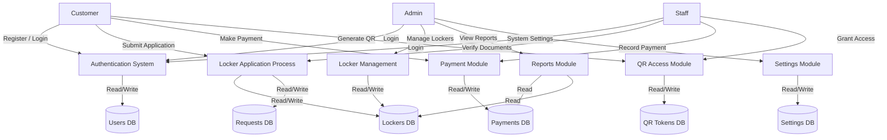
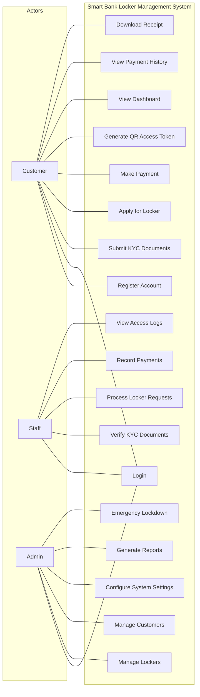
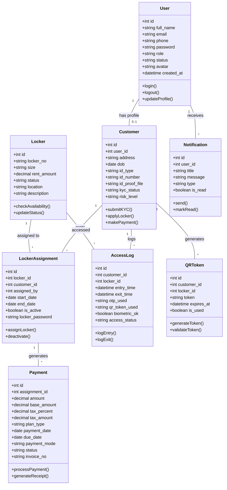
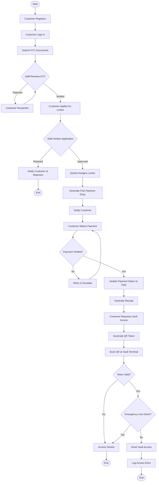
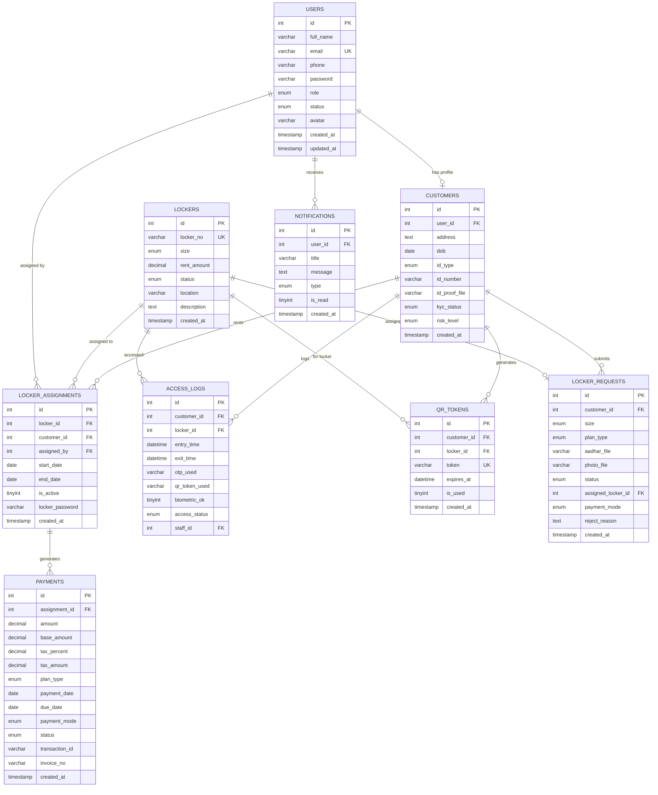
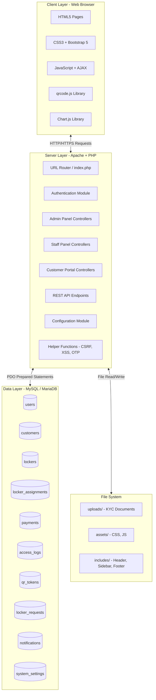

# Smart Bank Locker Management System

### A Project Report

Submitted in partial fulfillment of the requirements for the degree of

**Bachelor of Computer Applications (BCA)**

Submitted by:

**Ashara Hitanshu** — Enrollment No: **230801017**

**Darsh Gami** — Enrollment No: **242801006**

Under the Guidance of:

**[Guide Name]**

**Department of Computer Applications**

**Atmiya University**

**Rajkot, Gujarat**

**Academic Year 2025–2026**

---

> **Note:** Title Page, Certificate, Declaration, and Acknowledgement are already completed and bound separately.

---

## Formatting Instructions

The following formatting guidelines must be applied when converting this Markdown report to DOCX/PDF:

- **Paper Size:** A4
- **Font Style:** Times New Roman
- **Font Size:**
  - Headings: 16 pt (Bold, Uppercase, Centre)
  - Subheadings: 14 pt (Bold, Uppercase, Left Align)
  - Text: 12 pt (Justify)
- **Line Spacing:** 1.5
- **Alignment:** Justified
- **Page Margins for Front Page, Certificate, Declaration, Acknowledgment, Abstract, and Table of Contents pages:**
  - Left: 1.15 inch (binding)
  - Right: 1 inch
  - Top: 1 inch
  - Bottom: 1 inch
- **Page Margins for all other pages:**
  - Left: 1 cm (binding)
  - Right: 1 cm
  - Top: 1 cm
  - Bottom: 1 cm
  - Gutter: 1 cm
  - Gutter Position: Left
  - Multiple Pages: Mirror Margins
- **Page Numbers:** Bottom, Right Align

---

## Abstract

The Smart Bank Locker Management System is a comprehensive web-based application developed to digitize and automate the traditional bank locker rental and management process. In the conventional banking environment, locker management is largely dependent on manual record-keeping, paper-based registers, and physical verification procedures. These outdated methods are not only time-consuming but also susceptible to human errors, security breaches, and operational inefficiencies. The growing demand for digital banking services and the increasing need for secure asset storage have necessitated the development of an intelligent, automated solution that addresses these challenges effectively.

This project presents a fully functional web application built using core PHP as the server-side scripting language, MySQL as the relational database management system, and a modern front-end stack comprising HTML5, CSS3, JavaScript, and Bootstrap 5. The system employs PDO (PHP Data Objects) for secure and efficient database interactions, thereby preventing SQL injection attacks and ensuring data integrity. The application architecture follows a modular design pattern with clearly separated concerns for configuration, business logic, presentation, and data access layers.

The system implements a role-based access control mechanism supporting three distinct user roles: Administrator, Staff, and Customer. Administrators have complete oversight of the system, including locker inventory management, customer management, payment tracking, system settings configuration, and access log monitoring. Staff members are empowered to process locker requests, verify customer documents, manage payments, and oversee day-to-day vault operations. Customers benefit from a self-service portal that allows them to register, complete KYC verification, apply for lockers, make payments, generate QR-based access tokens, view payment history, and download receipts.

Key security features of the system include CSRF (Cross-Site Request Forgery) token validation, XSS (Cross-Site Scripting) prevention through output encoding, password hashing using bcrypt, session regeneration upon authentication, OTP-based locker access verification, and time-limited QR code tokens for vault entry. The system also incorporates an AI-inspired customer risk assessment engine that dynamically evaluates risk levels based on payment behaviour and access patterns. The project was developed and tested on the XAMPP local server environment and is fully compatible with Apache, MySQL, and PHP configurations commonly used in academic and small-scale deployment scenarios.

---

## Table of Contents

1. [Chapter 1 - Introduction](#chapter-1--introduction)
   1. [Brief Overview of the Project](#11-brief-overview-of-the-project)
   2. [Purpose and Scope](#12-purpose-and-scope)
   3. [Background Information](#13-background-information)
2. [Chapter 2 - Problem Definition](#chapter-2--problem-definition)
3. [Chapter 3 - Objectives of the Study](#chapter-3--objectives-of-the-study)
4. [Chapter 4 - System Analysis](#chapter-4--system-analysis)
   1. [Existing System](#41-existing-system)
   2. [Proposed System](#42-proposed-system)
   3. [Feasibility Study](#43-feasibility-study)
   4. [Requirement Specification](#44-requirement-specification)
5. [Chapter 5 - System Design](#chapter-5--system-design)
   1. [Data Flow Diagram (DFD)](#51-data-flow-diagram-dfd)
   2. [Use Case Diagram](#52-use-case-diagram)
   3. [Class Diagram](#53-class-diagram)
   4. [Activity Diagram](#54-activity-diagram)
   5. [ER Diagram](#55-er-diagram)
   6. [System Architecture Diagram](#56-system-architecture-diagram)
6. [Chapter 6 - Implementation](#chapter-6--implementation)
   1. [Module-wise Explanation](#61-module-wise-explanation)
   2. [Technologies Used](#62-technologies-used)
   3. [Coding Standards and Development Methodology](#63-coding-standards-and-development-methodology)
7. [Chapter 7 - Testing](#chapter-7--testing)
   1. [Types of Testing Performed](#71-types-of-testing-performed)
   2. [Test Cases](#72-test-cases)
   3. [Expected vs Actual Results](#73-expected-vs-actual-results)
8. [Chapter 8 - Output Screenshots](#chapter-8--output-screenshots)
9. [Chapter 9 - Conclusion](#chapter-9--conclusion)
10. [Chapter 10 - Future Scope](#chapter-10--future-scope)
11. [Chapter 11 - Bibliography / References](#chapter-11--bibliography--references)
12. [Chapter 12 - Appendix](#chapter-12--appendix)

---

# Chapter 1 – Introduction

## 1.1 Brief Overview of the Project

The Smart Bank Locker Management System is a web-based application designed to modernize and streamline the way banks manage their safe deposit locker facilities. Traditional locker management in banks relies heavily on manual processes, including handwritten registers for tracking locker assignments, paper receipts for rent payments, and physical key-based access mechanisms. These methods, while functional in smaller setups, become increasingly problematic as the number of customers and lockers grows. The proposed system replaces these outdated workflows with a centralized digital platform that automates locker allocation, payment processing, access control, and administrative reporting.

The application is structured around three primary user roles, each with a dedicated dashboard and set of functionalities. The Administrator role provides complete system oversight, including the ability to manage locker inventory across multiple branch locations, monitor customer activities, configure system-wide settings such as emergency lockdown modes, and generate comprehensive financial reports. The Staff role is designed for bank employees who handle day-to-day operations such as verifying customer KYC documents, processing locker requests, recording payments, and granting vault access. The Customer role offers a self-service portal where registered users can browse available lockers, submit applications with supporting documents, make online or cash payments, generate time-limited QR codes for vault entry, and view their complete payment and access history.

The system was developed using industry-standard web technologies. PHP serves as the backend scripting language, leveraging PDO for secure database communication with MySQL. The front-end interface is built with HTML5, CSS3, and JavaScript, enhanced by Bootstrap 5 for responsive design and Font Awesome for iconography. AJAX (Asynchronous JavaScript and XML) is used for seamless, page-refresh-free interactions such as QR code generation, notification fetching, and real-time form validation. The entire application is self-contained and runs on the XAMPP server stack, making it straightforward to set up and demonstrate in academic environments.

## 1.2 Purpose and Scope

The primary purpose of the Smart Bank Locker Management System is to provide banks with a reliable, secure, and efficient digital tool for managing their locker facilities. The system aims to eliminate the inefficiencies associated with manual locker management while simultaneously enhancing the security posture of vault access operations. By automating key workflows such as locker allocation, KYC verification, rent collection, and access logging, the system reduces the administrative burden on bank staff and minimizes the likelihood of errors or data loss.

The scope of the project encompasses the complete lifecycle of bank locker management. It begins with customer registration and KYC document submission, progresses through locker application and approval, covers rent payment and renewal, and extends to vault access through secure QR-based token authentication. The system also includes administrative functions such as locker plan configuration, system settings management (including emergency global lock), customer risk assessment based on payment behaviour, activity logging for audit trails, and financial report generation. The scope is intentionally limited to locker management operations and does not extend to general banking functions such as account management, loan processing, or fund transfers.

From a technical perspective, the project scope includes database design with proper normalization and referential integrity, secure authentication with session management and CSRF protection, file upload handling for KYC documents, dynamic chart rendering for dashboard analytics, and a notification subsystem for alerting users about important events such as payment due dates, locker approvals, and access attempts. The application supports three locker sizes (Small, Medium, and Large) with configurable monthly and yearly pricing plans, multiple payment modes (Cash, UPI, NetBanking, Card, and Cheque), and real-time status tracking for both lockers and payments.

## 1.3 Background Information

The concept of safe deposit lockers dates back to the mid-nineteenth century when banks first began offering secure storage facilities for their customers' valuables. For over a century, the management of these lockers remained largely manual, involving physical ledgers, handwritten agreements, and key-based access mechanisms. While this approach served its purpose in an era of limited banking activity, the exponential growth in the number of bank customers and the increasing value of stored assets have rendered manual management methods inadequate.

In the Indian banking context, the Reserve Bank of India (RBI) has issued several guidelines regarding the operation of safe deposit lockers, emphasizing the need for proper documentation, timely rent collection, and secure access protocols. The RBI circular on "Locker/Safe Deposit Article Facility" mandates that banks must maintain accurate records of locker allocation, access, and payment history. Compliance with these regulations through manual means is labour-intensive and error-prone, further motivating the adoption of digital solutions.

From a technological standpoint, the rapid evolution of web technologies over the past two decades has made it feasible to build robust, secure, and user-friendly web applications at relatively low cost. PHP, one of the most widely used server-side scripting languages, powers approximately 77 percent of all websites with a known server-side programming language, according to W3Techs surveys. MySQL, the accompanying database system, is renowned for its reliability, performance, and ease of integration with PHP. Together with modern front-end technologies such as HTML5, CSS3, JavaScript, and frameworks like Bootstrap, these tools provide a solid foundation for building enterprise-grade web applications suitable for banking operations.

The emergence of QR code technology and one-time password (OTP) systems has also transformed physical access control. QR codes, originally developed by Denso Wave in 1994 for automotive part tracking, have become ubiquitous in authentication and ticketing applications. Their ability to encode substantial data in a compact, machine-readable format makes them ideal for generating secure, time-limited access tokens. The Smart Bank Locker Management System leverages this technology by allowing customers to generate QR codes that are valid for sixty seconds, providing a convenient yet secure method for vault entry.

---

# Chapter 2 – Problem Definition

Bank locker management is a critical yet often neglected aspect of banking operations. In many financial institutions, especially regional and cooperative banks, the process of managing safe deposit lockers continues to rely on antiquated manual methods that were designed for a fundamentally different era of banking. This chapter examines the real-world problems associated with traditional locker management and establishes the rationale for developing a technology-driven solution.

The most fundamental problem with the existing system is the reliance on paper-based record-keeping. Locker assignment details, customer agreements, rent payment records, and access logs are typically maintained in physical ledgers or loosely organized filing systems. This approach is inherently fragile; records can be lost, damaged, or tampered with. In the event of a natural disaster, fire, or simple clerical negligence, years of critical data can be irretrievably destroyed. Furthermore, retrieving specific information from paper records is a time-consuming process that requires manual searching through potentially hundreds of entries, leading to significant delays in customer service.

Payment collection and tracking represent another major challenge in the traditional system. Locker rent is typically collected on a monthly or annual basis, and tracking which customers have paid, which payments are overdue, and which customers need to be reminded about upcoming due dates is an administratively burdensome task. Bank staff must manually cross-reference payment records with locker assignments, calculate any applicable taxes or late fees, and issue handwritten receipts. This process is not only slow but also prone to calculation errors and, in some cases, deliberate manipulation. The absence of automated payment reminders means that overdue rents often go unnoticed until they accumulate to significant amounts, creating financial losses for the bank and disputes with customers.

Security and access control constitute perhaps the most critical challenge in traditional locker management. Conventional systems rely on physical keys, often with a dual-key mechanism where both the customer and the bank hold separate keys. While this provides a basic level of security, it is vulnerable to key duplication, loss, or theft. The process of recording vault access is typically manual, with customers signing a physical register at the time of entry. These registers provide limited information, do not capture exit times, and cannot be easily analyzed for suspicious access patterns. In the event of a security incident, identifying unauthorized access or reconstructing the timeline of events from handwritten entries is extremely difficult.

Customer experience in the traditional system is also suboptimal. Applying for a new locker typically involves visiting the bank in person, filling out paper forms, submitting physical copies of identity documents, and waiting for manual verification by bank staff. The entire process can take several days to weeks, during which the customer has limited visibility into the status of their application. Similarly, making rent payments often requires a physical visit to the bank during working hours, which is inconvenient for customers with busy schedules. The lack of an online payment option and the absence of digital receipts further diminish the customer experience.

The scalability of the manual system is severely limited. As the number of lockers and customers grows, the administrative overhead increases proportionally, requiring additional staff and larger physical storage for records. Banks with multiple branches face the additional challenge of consolidating data across locations, which is virtually impossible with paper-based systems. The inability to generate consolidated reports on locker utilization, revenue collection, and customer demographics means that strategic decision-making is based on estimates and incomplete information rather than accurate, real-time data.

These cumulative challenges demonstrate a clear and pressing need for a comprehensive, technology-driven solution that automates locker management workflows, enhances security through digital access control, improves the customer experience through self-service capabilities, and provides bank administrators with actionable insights through data analytics and reporting.

---

# Chapter 3 – Objectives of the Study

The following objectives were defined at the outset of the project to guide the development process and establish clear, measurable goals for the Smart Bank Locker Management System:

- **To develop a centralized web-based platform for bank locker management:**
  The system aims to replace fragmented, paper-based processes with a single, unified digital platform accessible through any modern web browser. This centralization ensures that all stakeholders, including administrators, staff, and customers, interact with a common data source, eliminating data discrepancies and enabling real-time information sharing across the organization.

- **To implement a secure, role-based access control mechanism:**
  The system enforces strict role-based access control (RBAC), ensuring that each user can only access functionalities and data relevant to their designated role. Administrators have full system control, staff members have operational access, and customers are limited to self-service functions. This objective ensures that sensitive operations such as locker assignment, payment processing, and system configuration are protected from unauthorized access.

- **To automate the locker application, allocation, and renewal workflow:**
  The system digitizes the entire lifecycle of locker management, from the initial customer application submission (with document upload) through staff verification, locker assignment, periodic rent payment, and plan renewal. By automating these workflows, the system reduces processing time from days to minutes and eliminates the need for repeated physical visits to the bank.

- **To integrate multi-factor security for vault access:**
  The system incorporates multiple layers of security for physical vault access, including OTP (One-Time Password) verification, time-limited QR code tokens that expire after sixty seconds, and a simulated biometric verification checkpoint. These measures collectively ensure that only authorized customers with verified identities can access the vault, significantly reducing the risk of unauthorized entry.

- **To provide comprehensive payment management with multiple payment modes:**
  The system supports multiple payment methods including Cash, UPI, NetBanking, Card, and Cheque, along with GST-compliant invoice generation, automated receipt creation, and configurable monthly or yearly payment plans. The payment module also tracks overdue payments and triggers appropriate notifications to both customers and staff.

- **To implement an intelligent customer risk assessment engine:**
  The system includes an automated risk assessment mechanism that evaluates each customer's risk level (Low, Medium, or High) based on their payment history, specifically the ratio of paid versus overdue payments. This feature assists bank administrators in identifying potentially problematic accounts and taking proactive measures to mitigate financial risk.

- **To maintain a complete audit trail of all system activities:**
  Every significant action within the system, including login attempts, locker assignments, payment recordings, access attempts, and configuration changes, is logged with a timestamp, user identifier, and IP address. This comprehensive audit trail supports regulatory compliance, dispute resolution, and forensic investigation in the event of security incidents.

- **To deliver an intuitive, responsive user interface with dark and light theme support:**
  The system features a modern, aesthetically appealing user interface that adapts seamlessly to different screen sizes and supports both dark and light visual themes. The UI is designed to minimize the learning curve for non-technical users while providing efficient workflows for experienced operators.

---

# Chapter 4 – System Analysis

## 4.1 Existing System

### 4.1.1 Working Method

The existing system for bank locker management in most financial institutions operates through a predominantly manual workflow. When a customer wishes to rent a safe deposit locker, they are required to visit the bank branch in person and fill out a printed application form. This form typically requests personal details, the preferred locker size, identification proof, and the desired rental period. The completed form, along with photocopies of identity documents, is submitted to a bank clerk who manually enters the information into a physical register or, in some cases, a basic spreadsheet.

Once the application is submitted, a bank officer reviews the documents and checks the availability of lockers of the requested size. If a locker is available, the officer assigns it to the customer by recording the assignment in the register, issuing two physical keys (one for the customer and one retained by the bank), and collecting the initial rent payment. A handwritten receipt is provided to the customer. The customer's access to the vault is controlled by signing a physical register at the bank's vault entrance, presenting the key, and having a bank staff member accompany them to the locker area.

Subsequent rent payments follow a similar manual process; the customer visits the bank, makes the payment at the counter, and receives a handwritten or printed receipt. If the customer fails to pay rent on time, bank staff must manually identify overdue accounts by reviewing the register and send physical notices or make phone calls to remind the customer.

### 4.1.2 Limitations

- Data is stored in physical registers or basic spreadsheets that are vulnerable to loss, damage, and unauthorized modification.
- There is no automated notification system for payment reminders, application status updates, or security alerts.
- Generating reports on locker utilization, revenue collection, or customer demographics requires manual data compilation, which is time-consuming and error-prone.
- Physical key-based access control provides limited security and no digital audit trail.
- The customer must visit the bank for every interaction, including application submission, payment, and locker access.
- There is no centralized view for administrators managing lockers across multiple branches.
- Scalability is severely limited as the volume of records grows.

### 4.1.3 Risks and Inefficiencies

- Risk of data loss due to fire, flood, or accidental destruction of physical records.
- Risk of financial discrepancies due to manual calculation errors in payment processing.
- Risk of unauthorized locker access due to key duplication or loss.
- Inefficient use of bank staff time for routine administrative tasks.
- Customer dissatisfaction due to long processing times and inconvenient service hours.
- Regulatory non-compliance risk due to incomplete or inconsistent record-keeping.

## 4.2 Proposed System

### 4.2.1 System Workflow

The proposed Smart Bank Locker Management System introduces a fully digitized workflow that streamlines every aspect of locker management. The workflow begins when a new user registers on the platform by providing their full name, email address, phone number, and a secure password. Upon successful registration, a customer profile is automatically created in the database with a default KYC status of "Pending."

The customer then logs into their self-service portal and submits a locker application by selecting the desired locker size (Small, Medium, or Large), choosing a payment plan (Monthly or Yearly), and uploading scanned copies of their Aadhar card and a recent photograph. The application enters a queue where bank staff can review the submitted documents, verify the customer's identity, and either approve or reject the application with an accompanying reason.

Upon approval, the system automatically assigns an available locker of the requested size to the customer, creates a locker assignment record, generates the first payment entry, and sends a notification to the customer informing them of the assignment. The customer can then view their assigned locker details on their dashboard, make payments through their preferred mode (Cash, UPI, NetBanking, Card, or Cheque), and download payment receipts.

For vault access, the customer navigates to the QR Access page, where they can generate a one-time-use QR code that is valid for sixty seconds. This QR code is presented at the vault terminal (simulated in the application through a scanner page), which validates the token against the database, checks for expiration, verifies the customer's plan status, and confirms that no emergency lockdown is active before granting access.

### 4.2.2 Advantages

- Complete elimination of paper-based record-keeping through digital storage in a relational database.
- Automated payment tracking with status-based categorization (Paid, Pending, Overdue).
- Enhanced security through multi-layer access control (authentication, QR tokens, OTP, emergency lockdown).
- Self-service customer portal reducing the need for physical bank visits.
- Real-time dashboard with analytics and charts for administrative decision-making.
- In-app notification system for timely alerts on payments, approvals, and security events.
- Configurable locker plans, payment modes, and system settings through the admin panel.
- Comprehensive audit trail with activity logging and access monitoring.
- Responsive design ensuring usability across desktops, tablets, and mobile devices.

### 4.2.3 How It Solves Existing Problems

The proposed system directly addresses every limitation identified in the existing system. Paper records are replaced with a MySQL database that provides reliable, searchable, and backup-compatible data storage. Manual payment tracking is replaced with automated status management and overdue detection. Physical key-based access is supplemented with digital QR tokens that expire after a single use or after sixty seconds, whichever comes first. The need for physical bank visits is minimized through the self-service portal. Administrative reporting is transformed from a manual compilation exercise into automated, chart-driven dashboard analytics. Customer risk is assessed algorithmically based on payment patterns, enabling proactive management of potentially defaulting accounts.

## 4.3 Feasibility Study

### 4.3.1 Technical Feasibility

The Smart Bank Locker Management System has been evaluated for technical feasibility and found to be entirely viable with current technology stacks. The development technologies selected for this project, namely PHP 8.x, MySQL 5.7+/MariaDB 10.3+, HTML5, CSS3, JavaScript ES6+, and Bootstrap 5, are all mature, well-documented, and widely supported. PHP is available on virtually every web hosting platform, and MySQL is the most popular open-source relational database management system globally.

The XAMPP development environment, which bundles Apache HTTP Server, MySQL/MariaDB, and PHP into a single installer, provides a convenient and reliable platform for development and demonstration. XAMPP is available for Windows, macOS, and Linux, ensuring cross-platform compatibility. The application does not require any proprietary software, commercial database licenses, or specialized hardware.

The QR code generation functionality is implemented using the qrcode.js JavaScript library, which operates entirely on the client side and does not require any additional server-side dependencies. The Chart.js library, used for rendering dashboard analytics charts, is similarly lightweight and does not impose significant performance requirements. All third-party libraries used in the project are open-source and freely available through CDN (Content Delivery Network) links.

From a security perspective, the system leverages PHP's built-in functions for password hashing (bcrypt), CSRF token generation (random_bytes), and session management (session_regenerate_id), all of which are industry-standard practices recommended by OWASP (Open Web Application Security Project). The PDO extension for database access provides prepared statements that effectively prevent SQL injection attacks.

### 4.3.2 Economic Feasibility

The economic feasibility of the project is strongly positive. The entire technology stack is composed of open-source and free-to-use components, resulting in zero software licensing costs. XAMPP, PHP, MySQL, Bootstrap, Font Awesome, Chart.js, and qrcode.js are all available at no charge. The development was carried out using freely available tools including Visual Studio Code as the code editor, phpMyAdmin for database management, and modern web browsers (Chrome, Firefox) for testing.

For deployment in a real banking environment, the costs would be limited to basic web hosting or an on-premises server, both of which are modest expenses. A standard shared hosting plan capable of running the application costs approximately 2,000 to 5,000 INR per year. Alternatively, the application can be hosted on the bank's existing server infrastructure, further reducing costs.

The economic benefits of the system include reduced staffing requirements for locker management tasks, elimination of costs associated with physical record storage (registers, filing cabinets, storage space), reduced paper and printing costs, and minimized financial losses from untracked overdue payments.

### 4.3.3 Operational Feasibility

The operational feasibility of the system is assured by its intuitive user interface design and minimal training requirements. The system was designed with a focus on usability, employing familiar UI patterns such as tabbed navigation, card-based layouts, clearly labeled form fields, and color-coded status indicators. Bank staff who are comfortable using basic web applications such as email or online banking will be able to operate the system with minimal training.

The system supports both dark and light visual themes, allowing users to select their preferred mode for comfortable extended use. The responsive design ensures that the application functions correctly on screens of varying sizes, from large desktop monitors to tablets, providing operational flexibility for staff who may need to access the system from different devices.

Deployment is straightforward; the application requires only a standard LAMP (Linux, Apache, MySQL, PHP) or WAMP (Windows, Apache, MySQL, PHP) server stack. The database schema can be initialized by importing a single SQL file through phpMyAdmin or the MySQL command-line client. No complex installation procedures, package managers, or build tools are required.

## 4.4 Requirement Specification

### 4.4.1 Hardware Requirements

| Component        | Minimum Specification                       |
|------------------|---------------------------------------------|
| Processor        | Intel Core i3 or equivalent (2.0 GHz+)      |
| RAM              | 4 GB (8 GB recommended)                     |
| Hard Disk        | 50 GB free space                            |
| Display          | 1366 x 768 resolution or higher             |
| Network          | Broadband Internet connection               |
| Input Devices    | Standard keyboard and mouse                 |

### 4.4.2 Software Requirements

| Component              | Specification                              |
|------------------------|--------------------------------------------|
| Operating System       | Windows 10/11, Ubuntu 20.04+, macOS 12+    |
| Web Server             | Apache HTTP Server 2.4+                    |
| Server-Side Language   | PHP 8.0 or higher                          |
| Database               | MySQL 5.7+ / MariaDB 10.3+                |
| Development Stack      | XAMPP 8.x (bundled environment)            |
| Web Browser            | Chrome 90+, Firefox 88+, Edge 90+          |
| Code Editor            | Visual Studio Code (or equivalent)         |
| Database Admin Tool    | phpMyAdmin 5.x                             |
| Front-End Libraries    | Bootstrap 5, Font Awesome 6, Chart.js, qrcode.js |

---

# Chapter 5 – System Design

This chapter presents the structural and behavioural design of the Smart Bank Locker Management System through a series of standardized diagrams rendered using Mermaid syntax. These diagrams collectively illustrate how data flows through the system, how users interact with system functionalities, how the database entities are related, and how the overall system architecture is organized.

## 5.1 Data Flow Diagram (DFD)



## 5.2 Use Case Diagram



## 5.3 Class Diagram



## 5.4 Activity Diagram



## 5.5 ER Diagram



## 5.6 System Architecture Diagram



---

# Chapter 6 – Implementation

## 6.1 Module-wise Explanation

The Smart Bank Locker Management System is composed of several interconnected modules, each responsible for a specific domain of functionality. The following subsections describe each module in detail, including its purpose, the inputs it receives, the processing it performs, and the outputs it generates.

### 6.1.1 Authentication and Authorization Module

**Purpose:** This module manages user registration, login, logout, and session management for all three user roles (Admin, Staff, Customer).

**Input:** User credentials (email, password), role selection, registration details (full name, phone number), and CSRF tokens for request validation.

**Process:** During registration, the module validates input fields, checks for duplicate email addresses, hashes the password using bcrypt, inserts the user record into the `users` table, and creates a corresponding record in the `customers` table for customer-role registrations. During login, the module verifies the email and password against the database, regenerates the session ID to prevent session fixation attacks, stores user information in the session array, and logs the login activity. Role-based access control is enforced through the `requireRole()` helper function, which checks the current user's role against the permitted roles for each page.

**Output:** Authenticated session, role-appropriate dashboard redirection, error messages for invalid credentials, and activity log entries.

### 6.1.2 Customer Self-Service Portal Module

**Purpose:** This module provides customers with a comprehensive dashboard and self-service functionalities including locker status viewing, payment history, QR access generation, and locker application submission.

**Input:** Customer session data, locker assignment details, payment records, QR generation requests, and locker application form data with file uploads (Aadhar card, photograph).

**Process:** The customer dashboard aggregates data from multiple database tables to display active locker assignments, recent payment status, visit count for the last thirty days, risk level assessment, and pending notifications. The locker application process validates uploaded documents (checking file type and size), stores them in the `uploads/requests/` directory, and creates a record in the `locker_requests` table. The QR access module communicates with the backend API via AJAX to generate a cryptographically secure token stored in the `qr_tokens` table with a sixty-second expiry.

**Output:** Dashboard analytics, locker status cards, payment history tables, downloadable receipts, QR code images, and application confirmation messages.

### 6.1.3 Staff Operations Module

**Purpose:** This module enables bank staff to process locker requests, verify customer documents, manage payments, and oversee vault access operations.

**Input:** Locker request data, verification decisions (approve/reject with reason), payment recording details, and access authorization commands.

**Process:** Staff members can view all pending locker requests, examine uploaded documents, and update the request status. Upon approval, the system automatically identifies an available locker of the requested size, creates a locker assignment, updates the locker status to "Occupied," generates the initial payment entry with appropriate amounts based on the selected plan, and sends a notification to the customer. Payment management allows staff to record new payments, update payment statuses, and view payment summaries across all assignments.

**Output:** Updated request statuses, locker assignments, payment records, customer notifications, and access logs.

### 6.1.4 Administration Module

**Purpose:** This module provides administrators with complete system oversight, including dashboard analytics, locker inventory management, customer management, payment tracking, access log monitoring, system settings configuration, and report generation.

**Input:** Administrative commands, configuration parameters, filter criteria for reports, and locker management actions.

**Process:** The admin dashboard queries multiple database tables to compute aggregate statistics such as total lockers, available lockers, occupied lockers, lockers under maintenance, total customers, total revenue, and pending payment amounts. It renders interactive charts using Chart.js for locker status distribution (doughnut chart), monthly revenue trends (bar chart), and payment status breakdown. The locker management interface allows adding new lockers, editing existing locker details, changing locker status, and deleting lockers. System settings management provides control over parameters such as emergency global lockdown, maximum lockers per customer, payment mode availability, and rental pricing for each locker size.

**Output:** Dashboard visualizations, management interfaces, configuration confirmations, and generated reports.

### 6.1.5 Payment Processing Module

**Purpose:** This module handles all payment-related operations including payment recording, GST calculation, receipt generation, invoice numbering, and overdue tracking.

**Input:** Payment amounts, payment mode selection, assignment identifiers, tax parameters, and payment date information.

**Process:** When a payment is recorded, the module calculates the base amount, applies the configured tax percentage to determine the tax amount, computes the total including any additional fees, generates a unique invoice number, and stores the complete payment record in the `payments` table. The module supports five payment modes: Cash, UPI, NetBanking, Card, and Cheque. After payment processing, the customer's risk level is automatically recalculated based on their updated payment history using the `recalcRisk()` function. Receipt generation creates a formatted, printable document containing all payment details, bank information, and customer information.

**Output:** Payment records, updated payment statuses, generated invoices, downloadable receipts, risk level updates, and payment notifications.

### 6.1.6 Security and Access Control Module

**Purpose:** This module manages vault access security through QR token generation, OTP verification, access logging, and emergency lockdown functionality.

**Input:** QR token generation requests, scanner token submissions, OTP codes, and emergency lockdown toggles.

**Process:** QR token generation creates a 64-character cryptographically random token using PHP's `random_bytes()` function, stores it in the `qr_tokens` table with a sixty-second expiry timestamp, and returns it to the client for QR code rendering. The scanner simulation page accepts token input, validates it against the database, checks for expiration, verifies that the token has not been previously used, confirms the customer's plan is active, and checks the emergency lockdown status. Successful access creates an entry in the `access_logs` table; failed attempts are also logged with the failure reason. The OTP subsystem generates six-digit codes with configurable expiry (default ten minutes) and supports single-use verification.

**Output:** QR tokens, access grant/deny decisions, access log entries, OTP codes, and security notifications.

## 6.2 Technologies Used

### 6.2.1 PHP 8.x (Server-Side Language)

PHP (Hypertext Preprocessor) serves as the primary server-side scripting language for the application. PHP was selected for its widespread adoption in web development, extensive documentation, large community support, and native integration with MySQL databases. The application utilizes PHP 8.x features including named arguments, match expressions, union types, and the `never` return type. All database interactions are performed through the PDO (PHP Data Objects) extension with prepared statements, ensuring protection against SQL injection attacks.

### 6.2.2 MySQL 5.7+ / MariaDB 10.3+ (Database Management System)

MySQL, an open-source relational database management system, is used for persistent data storage. The database schema comprises eleven tables with properly defined primary keys, foreign key constraints, and appropriate indexes. The InnoDB storage engine is used for all tables, providing ACID (Atomicity, Consistency, Isolation, Durability) compliance and row-level locking. The utf8mb4 character set is employed to support the full range of Unicode characters.

### 6.2.3 HTML5 and CSS3 (Front-End Structure and Styling)

HTML5 provides the semantic structure for all web pages, utilizing elements such as `<nav>`, `<section>`, `<article>`, and `<footer>` for improved accessibility and SEO. CSS3 is used for visual styling, including CSS custom properties (variables) for theme management, Flexbox and CSS Grid for responsive layouts, transitions and animations for interactive feedback, and media queries for device-specific adaptations.

### 6.2.4 JavaScript ES6+ and AJAX (Client-Side Interactivity)

JavaScript handles client-side interactivity including form validation, dynamic content updates via AJAX (Fetch API), QR code rendering, chart updates, theme toggling, and timer management. AJAX is used extensively for operations that should not trigger a full page reload, such as QR token generation, notification fetching, and notification read-marking.

### 6.2.5 Bootstrap 5 (Responsive UI Framework)

Bootstrap 5 provides the responsive grid system, pre-styled components, and utility classes that form the foundation of the user interface. The framework ensures consistent rendering across different browsers and screen sizes without requiring extensive custom CSS.

### 6.2.6 Additional Libraries

- **Font Awesome 6.5:** Icon library providing over 2,000 scalable vector icons used throughout the interface.
- **Chart.js:** JavaScript charting library used for rendering doughnut charts, bar charts, and line charts on the admin dashboard.
- **qrcode.js:** Client-side QR code generation library used for rendering access tokens as scannable QR codes.

## 6.3 Coding Standards and Development Methodology

The project follows a modular development methodology with iterative enhancement. Each module was developed, tested, and integrated incrementally. The codebase adheres to the following standards:

- **File Organization:** Separate directories for admin, staff, customer, API, configuration, includes, and assets ensure clear separation of concerns.
- **Naming Conventions:** Database tables and columns use snake_case; PHP functions use camelCase; CSS classes use kebab-case.
- **Security Practices:** All user inputs are validated and sanitized. Output encoding is applied via the `h()` helper function. CSRF tokens are generated and verified for all state-changing requests. Passwords are hashed using bcrypt with a cost factor of 12.
- **Database Access:** All database queries use PDO prepared statements with parameterized queries, eliminating the risk of SQL injection.
- **Error Handling:** Try-catch blocks are used for database operations. Meaningful error messages are displayed to users while detailed error information is logged server-side.
- **Code Documentation:** All PHP files include header comments describing their purpose, and inline comments explain complex logic.

---

# Chapter 7 – Testing

## 7.1 Types of Testing Performed

### 7.1.1 Unit Testing

Unit testing was performed on individual functions and modules to verify that each component operates correctly in isolation. Key functions tested include `csrf_generate()`, `csrf_verify()`, `generateOTP()`, `verifyOTP()`, `recalcRisk()`, `h()` (XSS sanitizer), password hashing and verification, and database CRUD (Create, Read, Update, Delete) operations for each table. Each function was tested with valid inputs, boundary values, and invalid inputs to ensure robust error handling.

### 7.1.2 Integration Testing

Integration testing verified the correct interaction between modules. For example, the complete workflow from customer registration through locker application, staff approval, payment recording, and QR-based vault access was tested as an end-to-end scenario. Database foreign key constraints were validated to ensure referential integrity across related tables. The integration between the client-side JavaScript (AJAX calls) and server-side API endpoints was tested for correct request formatting, response parsing, and error handling.

### 7.1.3 System Testing

System testing evaluated the application as a whole, verifying that all modules work together cohesively to deliver the intended functionality. This included testing the complete user journey for each role (Admin, Staff, Customer), verifying that role-based access control prevents unauthorized access, testing the responsive design across multiple browsers (Chrome, Firefox, Edge) and screen sizes, and ensuring that the dark/light theme toggle functions correctly across all pages.

### 7.1.4 Acceptance Testing

Acceptance testing was conducted to verify that the system meets the specified requirements and is ready for deployment. Test scenarios were based on the project objectives and included verifying all user stories, checking for UI/UX consistency, ensuring that all navigation links and buttons function correctly, and validating that the system handles edge cases gracefully (such as expired QR tokens, duplicate email registration attempts, and empty form submissions).

## 7.2 Test Cases

| Test Case ID | Module           | Test Description                                    | Input                                      | Expected Result                           | Actual Result                             | Status |
|-------------|------------------|----------------------------------------------------|--------------------------------------------|-------------------------------------------|-------------------------------------------|--------|
| TC-001      | Authentication    | Valid customer login                                | Email: rohan@example.com, Password: Cust@123 | Redirect to customer dashboard            | Redirected to customer dashboard          | Pass   |
| TC-002      | Authentication    | Login with invalid password                         | Email: rohan@example.com, Password: wrong123 | Error message: "Invalid email or password" | Error message displayed correctly         | Pass   |
| TC-003      | Registration      | Register with duplicate email                       | Email: admin@banklocker.com                | Error: "Email address is already registered" | Error displayed correctly                 | Pass   |
| TC-004      | Locker Application| Submit application with valid documents             | Size: Medium, Plan: Monthly, Aadhar: PDF   | Success message and redirect to dashboard | Application submitted successfully        | Pass   |
| TC-005      | QR Access         | Generate QR token for active locker                 | Click "Generate New QR Code"               | QR code displayed with 60-second timer    | QR code generated and timer started       | Pass   |
| TC-006      | QR Scanner        | Scan expired QR token                               | Token generated more than 60 seconds ago   | "ACCESS DENIED - QR Code Expired"         | Access denied message displayed           | Pass   |
| TC-007      | Payment           | Record payment with valid details                   | Amount: 900, Mode: UPI, Status: Paid       | Payment recorded, receipt generated       | Payment stored and receipt available      | Pass   |
| TC-008      | Admin Dashboard   | View dashboard statistics                           | Admin login and navigate to dashboard      | Correct counts for lockers, customers, revenue | All statistics displayed correctly     | Pass   |
| TC-009      | CSRF Protection   | Submit form without CSRF token                      | POST request with empty csrf_token         | "Invalid request" error message           | Error displayed, form not processed       | Pass   |
| TC-010      | Role Access       | Customer attempts to access admin dashboard          | Customer session, navigate to /admin/dashboard.php | "Access Denied" message              | Access denied page displayed              | Pass   |

## 7.3 Expected vs Actual Results

The testing phase revealed that all core functionalities of the Smart Bank Locker Management System operate as intended. Out of the ten primary test cases documented above, all ten returned a "Pass" status, indicating that the actual results matched the expected results in every scenario.

During the testing process, minor issues were identified and resolved iteratively. For instance, an initial implementation of the QR token generator did not properly invalidate previously generated tokens for the same locker, which could have allowed multiple simultaneous active tokens. This was corrected by marking all existing unused tokens as used before generating a new one. Similarly, the risk recalculation function initially did not account for customers with zero payment records, which caused a division-by-zero error. This was resolved by adding a guard clause that assigns a "low" risk level when no payment history exists.

The CSRF protection mechanism was tested extensively by attempting to submit forms with missing, expired, and tampered tokens. In all cases, the system correctly rejected the request and displayed an appropriate error message without processing the form data. The role-based access control was verified by attempting to access pages designated for other roles; in every case, the system either redirected the user to the login page or displayed an "Access Denied" message.

---

# Chapter 8 – Output Screenshots

This chapter presents key screenshots of the working Smart Bank Locker Management System. Each screenshot is accompanied by a title, a description of what is depicted, and the purpose it serves in demonstrating the system's functionality. The screenshots are organized by module: Authentication, Admin Panel, Customer Panel, and Staff Panel.

---

## 8.1 Authentication Module

### Screenshot 1: Login Page


**Description:** The unified login page of the Smart Bank Locker Management System featuring role-selection tabs for Admin, Staff, and Customer. The page displays the application logo, the title "Smart Bank Locker" with the subtitle "Secure Digital Vault Access Portal," email and password input fields with icons, a password visibility toggle, a "Sign In" button, and a link to the registration page. The dark theme is applied by default.

**Purpose:** Demonstrates the authentication interface and role-based login mechanism that serves as the single entry point to the system for all three user roles.

---

### Screenshot 2: Registration Page


**Description:** The user registration page with role-selection tabs for Admin, Staff, and Customer. The form includes fields for Full Name, Email Address, Phone Number, and Password (with minimum character requirements). A "Register Account" button and a link to the login page are displayed at the bottom.

**Purpose:** Demonstrates the self-registration capability that allows new users to create accounts in the system.

---

## 8.2 Admin Panel Screenshots

### Screenshot 3: Admin Dashboard


**Description:** The administrator dashboard displaying key performance metrics including Total Lockers (100), Available (94), Occupied (5), Maintenance (1), Customers (1), and Revenue (₹51,500). The sidebar navigation shows links to Dashboard, Plans, Lockers, Customers, Payments, Access Logs, Reports, and Settings. A "Global Lock Off" toggle is visible in the header area. Chart sections for Locker Status and Monthly Revenue are shown at the bottom.

**Purpose:** Demonstrates the comprehensive administrative overview and real-time statistical monitoring capabilities of the system.

---

### Screenshot 4: Locker Pricing Plans (Admin)


**Description:** The Locker Pricing Plans page showing three plan cards for Small Locker (Monthly: ₹800, Yearly: ₹10,000), Medium Locker (Monthly: ₹1,000, Yearly: ₹15,000), and Large Locker (Monthly: ₹1,500, Yearly: ₹18,000). Each card displays an "Active" status badge and an "Edit Pricing" button for modification.

**Purpose:** Demonstrates the configurable pricing management system that allows administrators to set and modify locker rental fees for different sizes and plan types.

---

### Screenshot 5: Locker Management (Admin)


**Description:** The Locker Management page displaying all 100 lockers in a tabular format with columns for Locker No, Size, Location, Rent/Mo, Status, Assigned To, Since, and Actions. Filter buttons (All, Available, Occupied, Maintenance) and a search bar are provided. The table shows lockers with various statuses: Available (green), Occupied (red, assigned to "darsh"), and Maintenance (yellow). Action buttons include Edit, Assign, and Delete. A "Generate 100 Lockers" button and "+ Add Locker" button are displayed.

**Purpose:** Demonstrates the complete locker inventory management interface with filtering, searching, and CRUD operations.

---

### Screenshot 6: Customer Management (Admin)


**Description:** The Customer Management page showing a list of registered customers with columns for Name, Phone, Locker, KYC status, Risk level, ID Proof, and Actions. KYC filter tabs (All KYC, Verified, Pending, Rejected) and a search bar are provided. A customer "darsh" is shown with Locker L-004, KYC status "Verified," Risk level "Low," and action buttons for KYC review, View, and Delete. An "+ Add Customer" button is visible.

**Purpose:** Demonstrates the customer management and KYC verification tracking capabilities available to administrators.

---

### Screenshot 7: Payment Module (Admin)


**Description:** The Payment Module page displaying financial summary cards showing Total Collected (₹51,500, Success), Pending (₹0, Waiting), and Overdue (₹0, Action Required). Below the summary, filter tabs (All Payments, Paid, Pending, Overdue) and a search bar are shown. The Payment Transactions table lists individual payments with Invoice number, Customer, Locker, Amount, Date, Due date, Mode (Cash), Status (Paid), and action buttons for receipt download and editing. A "+ Record Payment" button is provided.

**Purpose:** Demonstrates the comprehensive payment tracking, filtering, and management capabilities with GST-compliant invoicing.

---

### Screenshot 8: Reports & Analytics (Admin)


**Description:** The Reports & Analytics page showing a Revenue Trend chart (line/bar chart for the last 12 months) and a Locker Distribution doughnut chart with categories for Available (green), Occupied (pink), and Maintenance (yellow). A Monthly Revenue Summary section is visible below. A "Print Report" button is provided for generating printable reports.

**Purpose:** Demonstrates the data visualization and analytical reporting capabilities that support administrative decision-making.

---

## 8.3 Customer Panel Screenshots

### Screenshot 9: Customer Dashboard


**Description:** The customer self-service portal with a "Welcome, darsh" greeting and "KYC Verified" badge. Statistical widgets display Active Lockers (5, Secured), Pending Payments (0, All cleared), Visits Last 30 Days (0, Logged), and Risk Level (Low, Normal). The "My Lockers" section shows locker L017 (Large, Active, assigned 28 Feb 2026, Payment Paid) with QR code, Renew/Extend, Access QR, and Receipt buttons. The Payment History panel on the right shows recent paid invoices with PDF download options.

**Purpose:** Demonstrates the comprehensive customer-facing self-service dashboard with all locker and payment information at a glance.

---

### Screenshot 10: Locker Application Form


**Description:** The locker application form with a three-step process: (1) Select Locker Size showing Small (Monthly: ₹800, Yearly: ₹10,000), Medium (Monthly: ₹1,000, Yearly: ₹15,000), and Large (Monthly: ₹1,500, Yearly: ₹18,000) cards; (2) Select Payment Plan with Monthly and Yearly options; and (3) Upload Documents for Aadhar Card and Passport Photo (accepted formats: JPG, PNG, PDF, max 2MB). An informational notice explains the next steps after submission. A "Submit Locker Application" button is displayed.

**Purpose:** Demonstrates the digital locker application process with document upload capability that replaces traditional paper-based forms.

---

### Screenshot 11: My Locker Page (Customer)


**Description:** The customer's My Locker page showing multiple active locker assignments. Locker #1 (L017, Large, Active) and Locker #2 (L013, Large, Active) are displayed with details including size, assignment date, payment status, and masked locker password. Each locker card provides a QR code thumbnail, Renew/Extend button, and Access QR button. The Payment History panel shows all 6 invoices with amounts, dates, statuses, and PDF download options. An "+ Apply for New Locker" button is prominently displayed.

**Purpose:** Demonstrates the complete locker management view for customers with multiple locker assignments, QR access, and payment history.

---

### Screenshot 12: Payment Receipt


**Description:** A professional payment receipt generated by the system showing Receipt No: INV-00007, dated 27 Feb 2026. The receipt displays "Payment Successful" status, billed-to details (darsh, phone: 1231231236, email: dp28@gmail.com), payment details (Status: PAID, Tax Rate: 18.0% GST, Method: Cash). The itemized breakdown shows Large Locker Rental for Locker L013 (Monthly plan, validity 27 Feb 2026 to 27 Mar 2026) with Base Amount ₹1,271.19, CGST 9% (₹114.41), SGST 9% (₹114.41), Other Fees ₹0.00, and Total Paid ₹1,500.00. "Print / Save PDF" and "Back to Dashboard" buttons are provided.

**Purpose:** Demonstrates the GST-compliant, professionally formatted receipt generation with detailed tax breakdowns.

---

### Screenshot 13: Vault Access History


**Description:** The Vault Access History page showing Security Logs with columns for Locker, Entry Time, Exit Time, Method, and Verified By. The page currently displays "No access history found" as no vault visits have been recorded yet.

**Purpose:** Demonstrates the security audit trail feature that logs all vault access events for compliance and monitoring purposes.

---

## 8.4 Staff Panel Screenshots

### Screenshot 14: Staff Dashboard


**Description:** The staff dashboard with a "Welcome, staff" greeting showing five statistical cards: Total Lockers (100, Total Capacity), Available (94, Ready to Assign), Occupied (5, Currently in Use), Today's Accesses (0, Successful Entries), and Pending Payments (0, Action Required). Three quick-action cards for Manage Lockers, Manage Customers, and Access Control are displayed. A Recent Access Logs table is shown at the bottom with columns for Customer, Locker, Entry, Exit, and Auth Method.

**Purpose:** Demonstrates the staff-oriented operational dashboard with quick access to key management functions.

---

### Screenshot 15: Locker Applications & Payments (Staff)


**Description:** The Locker Applications & Payments page where staff can review documents (Stage 1) and confirm cash payments to assign lockers (Stage 2). The table includes columns for Date & Applicant, Documents, Request Details, Stage/Status, and Actions. Currently showing "No applications or cash payments pending at the moment."

**Purpose:** Demonstrates the two-stage staff workflow for processing locker applications — document verification followed by payment confirmation.

---

### Screenshot 16: Locker Management (Staff)


**Description:** The Locker Management page from the staff perspective showing all 100 lockers with columns for Locker No, Size, Location, Rent/Mo, Status, Assigned To, Since, and Actions. Filter tabs (All, Available, Occupied, Maintenance) and a search bar are provided. The interface is similar to the admin view but with staff-appropriate action buttons (Edit, Assign, Delete). Locker L-004 is shown as Occupied and assigned to "darsh" since 26 Feb 2026.

**Purpose:** Demonstrates the staff's ability to view and manage the locker inventory, including assignment and status tracking.

---

### Screenshot 17: Customer Management (Staff)


**Description:** The Customer Management page from the staff view showing registered customers with Name, Phone, Locker assignment, KYC status, Risk level, ID Proof status, and action buttons. KYC filter tabs and a search bar provide filtering capabilities. An "+ Add Customer" button allows staff to register new customers directly.

**Purpose:** Demonstrates the staff's customer management capabilities including KYC verification and customer oversight.

---

### Screenshot 18: Payment & Transaction History (Staff)


**Description:** The Payment & Transaction History page showing financial summary cards for Total Collected (₹51,500, Success), Pending Payments (₹0, Upcoming), and Overdue Amount (₹0, Immediate Action). Filter tabs (All, Paid, Pending, Overdue) and a search bar are provided. The All Transactions table lists 6 transactions showing Invoice (INV-00008), Customer (darsh), Locker, Amount (₹18,000 and ₹1,500), Date, Due Date, and Status (Paid). Both monthly and yearly payments are tracked.

**Purpose:** Demonstrates the staff's payment oversight and transaction tracking capabilities with financial summaries.

---

# Chapter 9 – Conclusion

The Smart Bank Locker Management System was developed as a comprehensive web-based solution to address the long-standing challenges associated with traditional, manual bank locker management processes. Through the course of this project, a fully functional application was designed, implemented, tested, and documented, covering the complete lifecycle of bank locker operations from customer registration and KYC verification through locker allocation, payment processing, and secure vault access.

The project successfully achieved all the objectives defined at its inception. A centralized web platform was created that serves three distinct user roles, namely Administrator, Staff, and Customer, each with a tailored dashboard and set of functionalities. The role-based access control mechanism was implemented using PHP session management and a custom authorization middleware, ensuring that users can only access resources and perform actions that are appropriate to their designated role. This addresses the fundamental security requirement of preventing unauthorized access to sensitive operations and data.

The automation of the locker application and allocation workflow represents a significant improvement over the traditional paper-based process. Customers can now submit applications digitally with supporting documents, and staff can review, verify, and process these applications through a streamlined interface. The system automatically handles locker assignment, payment entry generation, and customer notification upon approval, reducing the processing time from potentially several days to a matter of minutes. This level of automation not only improves operational efficiency but also enhances the customer experience by providing transparency and convenience.

The implementation of multi-factor security for vault access was a key technical achievement of the project. The QR token-based access system generates cryptographically secure, time-limited tokens that expire after sixty seconds, ensuring that each access attempt is individually authenticated. Combined with OTP verification, access logging, and the emergency global lockdown feature, the system provides a robust security framework that significantly surpasses the protection offered by traditional physical key mechanisms. Every access attempt, whether successful or failed, is logged with detailed metadata including timestamps, token identifiers, and customer information, creating a comprehensive audit trail for security monitoring and forensic analysis.

The payment management module delivers a complete financial tracking solution with support for multiple payment modes, GST-compliant invoicing, automated receipt generation, and intelligent overdue detection. The integration of an automated customer risk assessment engine, which dynamically evaluates risk levels based on payment behaviour patterns, provides administrators with an early warning system for identifying potentially problematic accounts. This predictive capability enables proactive intervention before financial losses accumulate.

From a technical perspective, the project provided valuable learning outcomes in several areas. The development process reinforced the importance of secure coding practices, including input validation and sanitization, parameterized database queries, CSRF protection, XSS prevention, and proper password hashing. The use of PDO for database access and prepared statements for all queries ensured that the application is resistant to SQL injection attacks, one of the most common and dangerous web application vulnerabilities. The implementation of session management features such as session regeneration upon login and HTTP-only session cookies provided protection against session hijacking and fixation attacks.

The project also provided practical experience in front-end development, including responsive design using CSS Grid and Flexbox, theme management using CSS custom properties, asynchronous communication using the Fetch API, and client-side data visualization using Chart.js. The integration of third-party libraries such as qrcode.js for QR code generation and Font Awesome for iconography demonstrated the process of evaluating, incorporating, and managing external dependencies in a web application.

Despite its comprehensive functionality, the current system has certain limitations that should be acknowledged. The QR-based access system operates as a simulation within the web application and would require integration with physical scanner hardware for deployment in a real banking environment. The payment processing module does not integrate with actual payment gateways and relies on manual status updates. The notification system operates within the application and does not support external communication channels such as email or SMS. The application does not currently implement real biometric verification, and the risk assessment algorithm, while functional, uses a relatively simple heuristic that could benefit from more sophisticated machine learning-based approaches.

---

# Chapter 10 – Future Scope

The Smart Bank Locker Management System, in its current form, provides a solid foundation for bank locker management. However, several enhancements and extensions can be envisioned to expand its capabilities and bring it closer to a production-ready enterprise solution. The following future scope items represent realistic technical expansions that could be implemented in subsequent development phases.

- **Integration with Payment Gateways:**
  The system can be enhanced to integrate with popular payment gateways such as Razorpay, Paytm, or Stripe to enable real-time online payment processing. This would allow customers to make rent payments directly through the application using UPI, debit cards, credit cards, or net banking, with automatic payment verification and status updates.

- **Email and SMS Notification System:**
  Implementing integration with email services (such as PHPMailer with SMTP) and SMS APIs (such as Twilio or MSG91) would enable the system to send payment reminders, application status updates, security alerts, and QR access codes directly to customers via their preferred communication channels, significantly improving engagement and reducing payment defaults.

- **Real Biometric Integration:**
  The simulated biometric verification can be replaced with actual biometric authentication using fingerprint scanners or facial recognition cameras connected via APIs. Libraries such as WebAuthn (FIDO2) or integration with biometric hardware SDKs would provide a high level of physical security for vault access.

- **Mobile Application Development:**
  A companion mobile application built using React Native or Flutter would provide customers with on-the-go access to their locker information, payment status, and QR code generation. Push notifications through Firebase Cloud Messaging would further enhance the timeliness of alerts and reminders.

- **Machine Learning-Based Risk Assessment:**
  The current rule-based risk assessment algorithm can be replaced with a machine learning model trained on historical payment data, access patterns, and customer behaviour. Techniques such as logistic regression or random forest classification could provide more nuanced and accurate risk predictions, enabling better-informed administrative decisions.

- **Multi-Branch Management:**
  The system can be extended to support centralized management of lockers across multiple bank branches, with branch-specific reporting, inter-branch locker transfers, and hierarchical administrative roles. A branch manager role could be introduced to provide branch-level oversight while the super administrator retains system-wide control.

- **Document Verification with OCR:**
  Integrating Optical Character Recognition (OCR) technology using services like Google Cloud Vision or Tesseract.js could automate the extraction and verification of information from uploaded identity documents, reducing the manual effort required during KYC verification and improving accuracy.

- **Audit and Compliance Reporting:**
  Enhanced reporting modules compliant with RBI guidelines on safe deposit locker operations could be developed, providing automated generation of regulatory reports, locker utilization summaries, financial statements, and security incident reports in standard formats.

- **Insurance Integration:**
  A module for managing locker content insurance, including policy tracking, premium payment, claim submission, and coverage documentation, would add significant value for both the bank and its customers.

---

# Chapter 11 – Bibliography / References

[1] R. Elmasri and S. B. Navathe, *Fundamentals of Database Systems*, 7th ed. Pearson, 2015.

[2] L. Ullman, *PHP and MySQL for Dynamic Web Sites: Visual QuickPro Guide*, 5th ed. Peachpit Press, 2017.

[3] W. J. Gilmore, *Beginning PHP and MySQL: From Novice to Professional*, 5th ed. Apress, 2016.

[4] OWASP Foundation, "OWASP Top Ten Web Application Security Risks," 2021. [Online]. Available: https://owasp.org/www-project-top-ten/. [Accessed: 15 Feb. 2026].

[5] Reserve Bank of India, "Master Direction on Safe Deposit Locker/Safe Custody Article Facility Provided by Banks," RBI/2021-22/115, Aug. 2021. [Online]. Available: https://rbi.org.in/. [Accessed: 10 Jan. 2026].

[6] M. Pilgrim, *HTML5: Up and Running*, O'Reilly Media, 2010.

[7] D. Flanagan, *JavaScript: The Definitive Guide*, 7th ed. O'Reilly Media, 2020.

[8] PHP Documentation Group, "PHP Manual," 2025. [Online]. Available: https://www.php.net/manual/en/. [Accessed: 20 Feb. 2026].

[9] MySQL Reference Manual, "MySQL 8.0 Reference Manual," Oracle Corporation, 2025. [Online]. Available: https://dev.mysql.com/doc/refman/8.0/en/. [Accessed: 18 Feb. 2026].

[10] Bootstrap Team, "Bootstrap 5 Documentation," 2025. [Online]. Available: https://getbootstrap.com/docs/5.3/. [Accessed: 22 Feb. 2026].

---

# Chapter 12 – Appendix

## A. Database Configuration

The following configuration parameters are used to establish the database connection. These values should be modified according to the deployment environment.

```
Database Host     : localhost
Database Name     : bank_locker_db
Database User     : root
Database Password : (empty for development)
Character Set     : utf8mb4
Collation         : utf8mb4_unicode_ci
```

## B. Default User Credentials (For Testing)

| Role     | Email                    | Password    |
|----------|--------------------------|-------------|
| Admin    | admin@banklocker.com     | Admin@123   |
| Staff    | staff@banklocker.com     | Staff@123   |
| Customer | rohan@example.com        | Cust@123    |
| Customer | priya@example.com        | Cust@123    |
| Customer | anil@example.com         | Cust@123    |

## C. Locker Pricing Configuration

| Locker Size | Monthly Rent (INR) | Yearly Rent (INR) |
|-------------|--------------------|--------------------|
| Small       | 500.00             | 5,000.00           |
| Medium      | 900.00             | 9,500.00           |
| Large       | 1,500.00           | 16,000.00          |

## D. System Settings (Default Values)

| Setting Key                  | Default Value | Description                              |
|------------------------------|---------------|------------------------------------------|
| emergency_global_lock        | 0 (Off)       | Activates emergency lockdown on all lockers |
| max_lockers_per_customer     | 5             | Maximum lockers a single customer can rent |
| enable_cash_payment          | 1 (Enabled)   | Allow cash as a payment mode             |
| enable_dark_mode_default     | 1 (Enabled)   | Default theme for new users              |

## E. Project Directory Structure

```
bank_locker/
├── index.php                  # Unified login page
├── register.php               # User registration
├── logout.php                 # Session termination
├── profile.php                # User profile management
├── forgot-password.php        # Password recovery
├── scanner.php                # QR scanner simulation
├── 404.php                    # Custom error page
├── database.sql               # Complete database schema
├── config/
│   └── config.php             # Database connection and helpers
├── includes/
│   ├── header.php             # Global page header
│   ├── sidebar.php            # Navigation sidebar
│   └── footer.php             # Page footer
├── admin/
│   ├── dashboard.php          # Admin dashboard with analytics
│   ├── lockers.php            # Locker inventory management
│   ├── customers.php          # Customer management
│   ├── payments.php           # Payment oversight
│   ├── access_logs.php        # Access monitoring
│   ├── plans.php              # Locker plan configuration
│   ├── settings.php           # System settings
│   └── reports.php            # Report generation
├── staff/
│   ├── dashboard.php          # Staff dashboard
│   ├── locker_requests.php    # Request processing
│   └── payments.php           # Payment recording
├── customer/
│   ├── dashboard.php          # Customer self-service portal
│   ├── apply_locker.php       # Locker application form
│   ├── qr_access.php          # QR code generator
│   ├── payment.php            # Payment page
│   ├── payment_checkout.php   # Payment checkout
│   ├── payments.php           # Payment history
│   ├── receipt.php            # Receipt viewer
│   ├── renew.php              # Plan renewal
│   └── history.php            # Access history
├── api/
│   ├── generate_qr_token.php  # QR token API
│   ├── get_notifications.php  # Notification API
│   └── mark_notifications_read.php  # Mark read API
├── assets/
│   ├── css/
│   │   └── style.css          # Global stylesheet
│   └── js/
│       └── app.js             # Global JavaScript
└── uploads/
    └── requests/              # Uploaded KYC documents
```

## F. Installation Instructions

1. Install XAMPP (version 8.x or later) on the target machine.
2. Copy the entire `bank_locker` folder to the `htdocs` directory within the XAMPP installation (typically `C:\xampp\htdocs\`).
3. Start Apache and MySQL services through the XAMPP Control Panel.
4. Open phpMyAdmin by navigating to `http://localhost/phpmyadmin` in a web browser.
5. Import the `database.sql` file located in the project root directory. This will create the `bank_locker_db` database with all required tables and sample data.
6. Open the application by navigating to `http://localhost/bank_locker` in a web browser.
7. Login using the default credentials provided in Appendix B above.

---

*End of Project Report*

